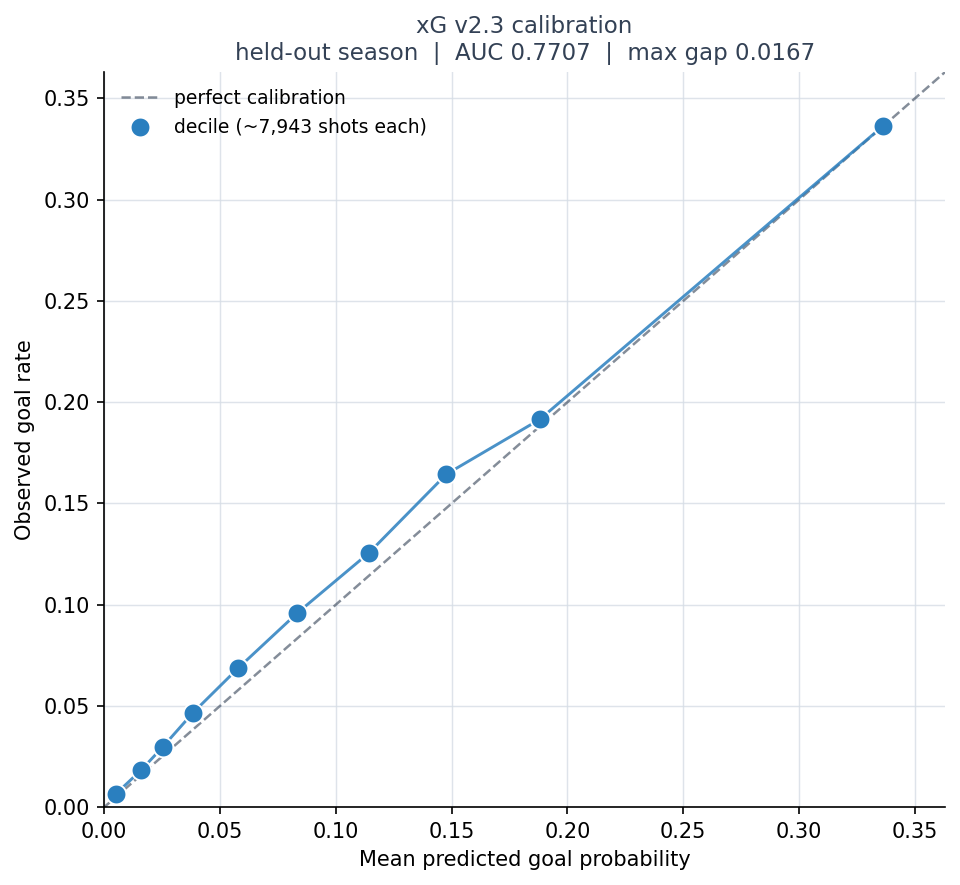

# Hockey Hacks

An expected goals (xG) model for the NHL, built end to end: ingest from the public NHL API, warehouse in PostgreSQL, train and calibrate with LightGBM.


## The problem

The NHL publishes aggregated tracking metrics through NHL EDGE, but not the underlying per-frame coordinate feed. So a public xG model has to reconstruct shot quality from play-by-play events alone: where the shot came from, what happened just before it, who was on the ice, and what the strength state was.

**252,450 shots** across three seasons, 2022-23 through 2024-25.

## Pipeline

### Stage A — Ingest

Play-by-play, shift charts, and boxscores from `api-web.nhle.com` and `api.nhle.com`, cached as raw JSON and parsed into PostgreSQL. Parsers are pure standard library and covered by synthetic-payload tests, which is why CI runs with zero dependencies.

Two bugs worth naming, because both were silent:

- **Coordinate normalization.** Assuming rink orientation from convention put roughly 28% of shots more than 100 ft from the goal. Deriving the normalization empirically from the data fixed it.
- **Shift intervals.** Treating shifts as closed on both ends produced impossible on-ice player counts. Switching to half-open `[start, end)` dropped those from 5,008 to 14.

### Stage B — Player priors

`features/build_priors.py` fits Beta-Binomial empirical Bayes priors for shooter finishing, stratified by strength state (5v5 / PP / PK) with recency weighting. Shrinkage is the point: a player with one shot and one goal must not be handed a 100% shooting rate.

The version that matters is `build_priors_expanding.py`, which resolves a prior per `(player, game_date)` from a trailing window, so no shot is ever scored with information from its own date or later.

### Stage C — The model

LightGBM, with a strict temporal split throughout: train on 2022-23, validate on 2023-24, test on 2024-25. Never a random split.

## Results

Held-out 2024-25 season. Full artifacts in [`results/`](results/).

| Version | What changed | Test AUC | Max calibration gap |
|---|---|---|---|
| v1 | Clean geometric baseline. No player priors of any kind. | 0.7705 | 0.0244 |
| v2.2 | Static per-player prior, pooled across training seasons. | 0.7666 | 0.0188 |
| **v2.3** | **Expanding-window prior, resolved per game-date.** | **0.7706** | **0.0178** |



v2.3 is the champion not because it won on AUC — it matched the baseline to within 0.0001 — but because it has the best calibration of any version. The downstream consumer is a Monte Carlo simulator, which needs probabilities that are *correct*, not rankings that are *sharp*.

## Two things the iteration showed

**Pooled priors leak, and the leak looks like success.** An earlier version (v2) joined priors built across all three seasons and scored 0.7620 on test. v2.2 narrowed that to train+val and posted the **highest validation AUC of all three versions, 0.7875, alongside the lowest test AUC, 0.7666** — a val-to-test drop of 0.0209 against roughly 0.0075 for v1 and v2.3. The prior was built partly from the validation season, so the model was reading an answer key. Confirming signature: `shooter_prior_pct` earned 24,388 gain importance in v2.2 and 12,397 in v2.3. Remove the leak and the same feature gets half the weight.

**Most of the remaining calibration error is the league, not the model.** All three versions under-predict the test season by about 8% (mean predicted ≈ 0.100 against an actual rate of 0.108). Training-season goal rate was 10.25%; test season was 10.83%. Three differently-built models missing by the same margin is environment drift, not model error.

That rules out the obvious fix. Rescaling every prediction by 1.082 to close the mean makes the max gap *worse*, 0.0178 → 0.0206, because the top deciles are already calibrated. The correction has to be a monotone calibration map, not a constant.

## Running it

```bash
pip install -r requirements.txt
cp .env.example .env          # fill in Postgres credentials

python -m ingest.run_stage_a  # ingest (cached JSON in raw_data/ is reused)
python -m features.build_priors_expanding
python -m model.train_v2_3
```

Metrics, reliability tables, and calibration plots are written to `results/` and tracked in git. Model binaries are not.

## Not built yet

Goalie priors on the same expanding-window design, a rolling in-season recalibration layer, and the Monte Carlo game simulator those feed into.
