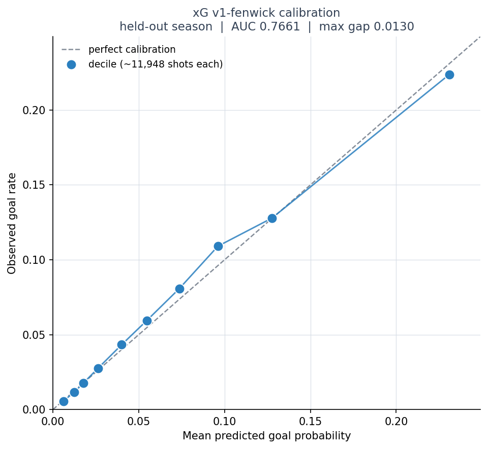

# Hockey Hacks

A personal project: an expected-goals (xG) model for the NHL, built end to end. It pulls data from the public NHL API, stores it in PostgreSQL, and trains and calibrates LightGBM models. It's meant to feed a Monte Carlo game simulator, which isn't built yet.

**Where it stands.** The current model, v1-fenwick, is trained on unblocked shot attempts. The held-out 2024-25 season had 3% more goals than it predicted, against 7% for the best shots-on-goal model. That figure is provisional (see [Known issues](#known-issues)). The full write-up is in [docs/FINDINGS.md](docs/FINDINGS.md).

## The problem

The NHL publishes aggregated tracking metrics through NHL EDGE, but not the underlying per-frame coordinate feed. So a public xG model has to estimate shot quality from play-by-play events alone: where the shot came from, what happened just before it, who took it and the game situation.

Data: 4,198 games, 2022-23 through 2024-25, regular season and playoffs.

## Pipeline

### Stage A — Ingest

Play-by-play, shift charts and boxscores from `api-web.nhle.com` and `api.nhle.com`, cached as raw JSON and parsed into PostgreSQL. The parsers use only the standard library and are covered by synthetic-payload tests, so those tests run in CI with nothing installed.

Two bugs worth naming, because both were silent:

- **Coordinate normalization.** Assuming rink orientation from convention put roughly 28% of shots more than 100 ft from the goal. Deriving the normalization empirically from the data fixed it.
- **Shift intervals.** Treating shifts as closed on both ends produced impossible on-ice player counts. Switching to half-open `[start, end)` dropped those from 5,008 to 14.

### Stage B — Player priors

`features/build_priors_expanding.py` fits Beta-Binomial empirical Bayes priors for shooter finishing, stratified by strength state (5v5 / PP / PK) and weighted toward recent seasons. Each prior is resolved per player per game date from a trailing two-year window, so no shot is scored with information from its own date or later. Shrinkage is the point: a player with one shot and one goal must not be handed a 100% shooting rate.

A units bug weakened that shrinkage. Recency weights of 5/4/3 made weighted shots about 4.5× raw shots, while the shrinkage constant K was fit on raw counts, so every player's record looked about 4.5× bigger than it was. Dividing the weights by 5 fixed the units; the weighted shooting rates didn't change, only the shrinkage did. Average self-weight (how much a player's own record counts against the league mean) fell from 0.77 to 0.49 at 5v5, from 0.46 to 0.18 on the power play and from 0.28 to 0.08 on the penalty kill ([before and after](results/prepatch/)).

### Stage C — The model

LightGBM with a strict temporal split: train on 2022-23, validate on 2023-24, test on 2024-25. Never a random split. Every training run checks that the score differential varies within games, which it does in more than 99% of them; if final scores had leaked into the features, it would be constant.

There are two shot tables:

- **Shots on goal** (`features/build_features.py`): 252,450 shots, including regular-season shootout attempts (about 0.6%). Frozen, so v1–v2.3 still reproduce.
- **Unblocked attempts**, known in hockey analytics as Fenwick (`features/build_features_fenwick.py`): 364,074 attempts (goals, shots on goal and missed shots), excluding shootout attempts. Two event types the NHL logs in only part of the window, teammate blocks (from 2023-24) and failed bank attempts (from 2024-25), are removed from the population and from every previous-event lookup. Wrist and snap are merged: snap's share of the two jumped from 20% to 30% in 2024-25 while their combined share held steady. Eight checks run on every build ([log](results/build_features_fenwick.log)).

The rebuild also closed a label leak. The original table codes a missing shot type as `'unknown'`, and `'unknown'` appears only on goals, so the category gives away the answer; v1–v2.3 trained with it. The new table keeps those rows and folds `'unknown'` into `'wrist-snap'`. One of the eight checks now flags any shot type, strength state or previous event type that is always or never a goal.

## Results

Held-out 2024-25 season. Full artifacts are in [`results/`](results/); the [leaderboard](results/leaderboard.md) adds PR-AUC, log loss and Brier score.

**Shots on goal**

| Version | What changed | Test AUC | Max calibration gap | O/E |
|---|---|---|---|---|
| v1 | Geometric baseline, no player priors | 0.7705 | 0.0244 | 1.08 |
| v2.2 | Static shooter prior, pooled over train + val | 0.7666 | 0.0188 | 1.08 |
| **v2.3** | **Shooter prior resolved per game date** | **0.7707** | **0.0167** | **1.07** |

**Unblocked attempts**

| Version | Split | AUC | Max calibration gap | O/E |
|---|---|---|---|---|
| v1-fenwick | Validation, 2023-24 | 0.7713 | 0.0090 | 1.02 |
| v1-fenwick | Test, 2024-25 | 0.7661 | 0.0130 | 1.03 |

O/E is observed ÷ predicted goals; 1.00 is right on average. The shots-on-goal O/E values are computed from each version's committed `reliability.csv`. AUC and calibration gap don't compare across the two tables, because the shots differ. O/E does, because both models predict the same season's goals.

Within the shots-on-goal table, v2.3 is the pick. It matches v1 on AUC and has the tightest calibration, and a simulator needs correct probabilities more than sharper rankings.

## What the iteration showed

**Part of the 2024-25 miss came from how the league records shots.** All three shots-on-goal versions under-predicted 2024-25 by 7–8%. Within each distance band under 60 ft, goals per shot on goal rose 6–9% from 2022-23 to 2024-25 while goals per unblocked attempt barely moved, the pattern you'd expect if some saves were being logged as misses. David Johnson at [Hockey Analysis](https://hockeyanalysis.com/2025/03/21/are-changes-in-nhl-shot-data-tracking-hiding-that-teams-are-getting-better-at-defending/) found missed shots rising across the league and suggested puck tracking as the likely cause: pucks a goalie stops may now be logged as misses if they were heading wide. A relabel like that doesn't change unblocked attempts, the standard population for public xG models, so the model now trains on them.

**Pooled priors leak, and the leak looks like success.** v2.2 pooled its shooter prior over the train and validation seasons. It posted the highest validation AUC of the three shots-on-goal versions (0.7875) and the lowest test AUC (0.7666): a drop of 0.0209, against 0.0075 for v1 and 0.0074 for v2.3. The prior contained validation-season outcomes, so validation looked better than it was. v2.3's per-game-date prior removes the leak.

## Known issues

- **'Short' misses.** Since 2023-24 the NHL's play-by-play has included missed shots with the reason 'short', which [HockeyStats.com](https://hockeystats.com/methodology/expected-goals) describes as much closer to fanned attempts or flubs. That puts them in validation and test but not training, and they haven't been counted here yet. None can be a goal, but the model still gives them xG, so removing them should raise O/E by an amount not yet measured.
- **2024-25 isn't a clean test any more.** The switch to unblocked attempts and the wrist/snap merge were both chosen after looking at that season. 2025-26, not yet ingested, is the real test.
- **The remaining miss isn't uniform.** Central shots (0–30°) are under-predicted in both validation and test, and wide-angle shots (45°+) are over-predicted ([segments](results/v1-fenwick/segments.csv)).
- **Two build checks flag open questions.** Attempts from behind the goal line spike in 2023-24 (0.767, 1.245 and 0.798 per game across the three seasons), and tip-in and slap conversion fall every season.

## Not built yet

The Monte Carlo simulator, and any trained model that uses goalie priors (the builder, `features/build_goalie_priors_expanding.py`, exists). Next, in order:

1. Count 'short' misses by season and, if they start in 2023-24, remove them. Explain the behind-the-line spike.
2. Ingest 2025-26 and roll the split forward: train 2023-24, validate 2024-25, test 2025-26, all after the recording change. 2022-23 only warms the priors.
3. Clean up the priors, then add the shooter prior (v2.3-fenwick) and zone-based goalie priors to the unblocked-attempt model.
4. Build the simulator in two layers: xG per unblocked attempt, then the chance an attempt reaches the net.

Alongside steps 2 and 3: compare the play-by-play's shot locations with NHL EDGE's counts by zone, to test whether recorded locations shifted.
